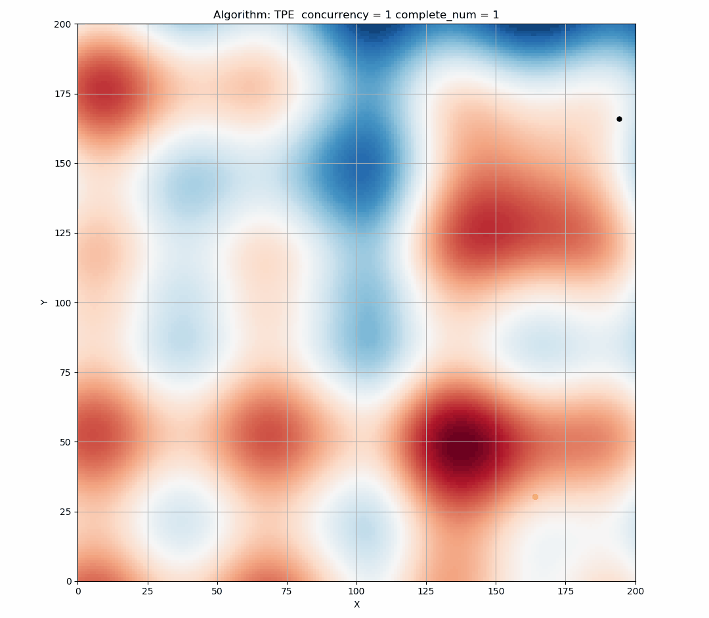
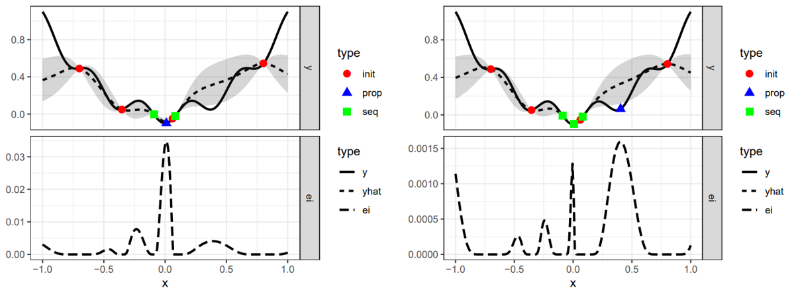

# Parallelizing a Sequential Algorithm TPE

TPE approaches were actually run asynchronously in order to make use of multiple compute nodes and to avoid wasting time waiting for trial evaluations to complete. For the TPE approach, the so-called constant liar approach was used: each time a candidate point x∗ was proposed, a fake fitness evaluation of the y was assigned temporarily, until the evaluation completed and reported the actual loss f(x∗).

## Introducion and Problems

### Sequential Model-based Global Optimization

Sequential Model-Based Global Optimization (SMBO) algorithms have been used in many applications where evaluation of the fitness function is expensive. In an application where the true fitness function f: X → R is costly to evaluate, model-based algorithms approximate f with a surrogate that is cheaper to evaluate. Typically the inner loop in an SMBO algorithm is the numerical optimization of this surrogate, or some transformation of the surrogate. The point x∗ that maximizes the surrogate (or its transformation) becomes the proposal for where the true function f should be evaluated. This active-learning-like algorithm template is summarized in the figure below. SMBO algorithms differ in what criterion they optimize to obtain x∗ given a model (or surrogate) of f, and in they model f via observation history H.

The algorithms in this work optimize the criterion of Expected Improvement (EI). Other criteria have been suggested, such as Probability of Improvement and Expected Improvement, minimizing the Conditional Entropy of the Minimizer, and the bandit-based criterion. We chose to use the EI criterion in TPE because it is intuitive, and has been shown to work well in a variety of settings. Expected improvement is the expectation under some model M of f : X → RN that f(x) will exceed (negatively) some threshold y∗:

Since calculation of p(y|x) is expensive, TPE approach modeled p(y|x) by p(x|y) and p(y).The TPE defines p(x|y) using two such densities:

where l(x) is the density formed by using the observations {x(i)} such that corresponding loss
f(x(i)) was less than y∗ and g(x) is the density formed by using the remaining observations. TPE algorithm depends on a y∗ that is larger than the best observed f(x) so that some points can be used to form l(x). The TPE algorithm chooses y∗ to be some quantile γ of the observed y values, so that p(y<`y∗`) = γ, but no specific model for p(y) is necessary. The tree-structured form of l and g makes it easy to draw manycandidates according to l and evaluate them according to g(x)/l(x). On each iteration, the algorithm returns the candidate x∗ with the greatest EI.

Here is a simulation of the TPE algorithm in a two-dimensional search space. The difference of background color represents different values. It can be seen that TPE combines exploration and exploitation very well. (Black indicates the points of this round samples, and yellow indicates the points has been taken in the history.)

**Since EI is a continuous function, the highest x of EI is determined at a certain status.** As shown in the figure below, the blue triangle is the point that is most likely to be sampled in this state.

TPE perfors well when we use it in sequential, but if we provide a larger concurrency, then **there will be a large number of points produced in the same EI state**, too concentrated points will reduce the exploration ability of the tuner, resulting in resources waste.

Here is the simulation figure when we set `concurrency=60`, It can be seen that this phenomenon is obvious.

## Research solution

### Approximated q-EI Maximization

The multi-points criterion that we have presented below can potentially be used to deliver an additional design of experiments in one step through the resolution of the optimization problem.

However, the computation of q-EI becomes intensive as q increases. After our research, there are four popular greedy strategies that approach the result of problem while avoiding its numerical cost.

#### Solution 1: Believing the OK Predictor: The KB(Kriging Believer) Heuristic Strategy

The Kriging Believer strategy replaces the conditional knowledge about the responses at the sites chosen within the last iterations by deterministic values equal to the expectation of the Kriging predictor. Keeping the same notations as previously, the strategy can be summed up as follows:

This sequential strategy delivers a q-points design and is computationally affordable since it relies on the analytically known EI, optimized in d dimensions. However, there is a risk of failure, since believing an OK predictor that overshoots the observed data may lead to a sequence that gets trapped in a non-optimal region for many iterations. We now propose a second strategy that reduces this risk.

#### Solution 2: The CL(Constant Liar) Heuristic Strategy

Let us now consider a sequential strategy in which the metamodel is updated (still without hyperparameter re-estimation) at each iteration with a value L exogenously fixed by the user, here called a ”lie”. The strategy referred to as the Constant Liar consists in lying with the same value L at every iteration: maximize EI (i.e. find xn+1), actualize the model as if y(xn+1) = L, and so on always with the same L ∈ R:

L should logically be determined on the basis of the values taken by y at X. Three values, min{Y}, mean{Y}, and max{Y} are considered here. **The larger L is, the more explorative the algorithm will be, and vice versa.**

We have simulated the method above. The following figure shows the result of using mean value liars to maximize q-EI. We find that the points we have taken have begun to be scattered.

## Experiment

### Branin-Hoo

The four optimization strtigeies presented in the last section are now complared on the Branin-Hoo function which is a classical test-case in global optimization.

The recommended values of a, b, c, r, s and t are: a = 1, b = 5.1 ⁄ (4π2), c = 5 ⁄ π, r = 6, s = 10 and t = 1 ⁄ (8π). This function has three global minimizers(-3.14, 12.27), (3.14, 2.27), (9.42, 2.47).

Next is the comparaison of the q-EI associated with the q first points (q ∈ [1,10]) given by the constant liar strategies (min and max), 2000 q-points designs uniformly drawn for every q, and 2000 q-points LHS designs taken at random for every q.

As we can seen on figure, CL[max] and CL[min] offer very good q-EI results compared to random designs, especially for small values of q.

### Gaussian Mixed Model function

We also compared the case of using parallel optimization and not using parallel optimization. A two-dimensional multimodal Gaussian Mixed distribution is used to simulate, the following is our result:

||concurrency=80|concurrency=60|concurrency=40|concurrency=20|concurrency=10|
|---|---|---|---|---|---|
|Without parallel optimization|avg =  0.4841   var =  0.1953|avg =  0.5155   var =  0.2219|avg =  0.5773   var =  0.2570|avg =  0.4680   var =  0.1994| avg = 0.2774   var = 0.1217|
|With parallel optimization|avg =  0.2132   var = 0.0700|avg =  0.2177 var =  0.0796| avg =  0.1835   var =  0.0533|avg =  0.1671   var =  0.0413|avg =  0.1918   var =  0.0697|

Note: The total number of samples per test is 240 (ensure that the budget is equal). The trials in each form were repeated 1000 times, the value is the average and variance of the best results in 1000 trials.

## References

[1] James Bergstra, Remi Bardenet, Yoshua Bengio, Balazs Kegl. "Algorithms for Hyper-Parameter Optimization". [Link](https://papers.nips.cc/paper/4443-algorithms-for-hyper-parameter-optimization.pdf)

[2] Meng-Hiot Lim, Yew-Soon Ong. "Computational Intelligence in Expensive Optimization Problems". [Link](https://link.springer.com/content/pdf/10.1007%2F978-3-642-10701-6.pdf)

[3] M. Jordan, J. Kleinberg, B. Scho¨lkopf. "Pattern Recognition and Machine Learning". [Link](http://users.isr.ist.utl.pt/~wurmd/Livros/school/Bishop%20-%20Pattern%20Recognition%20And%20Machine%20Learning%20-%20Springer%20%202006.pdf)
