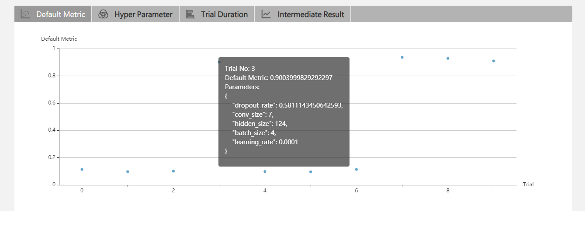
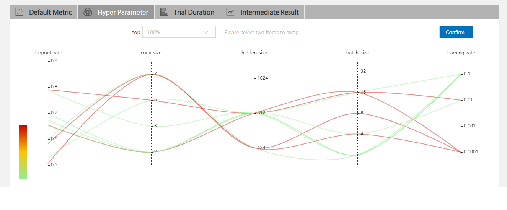
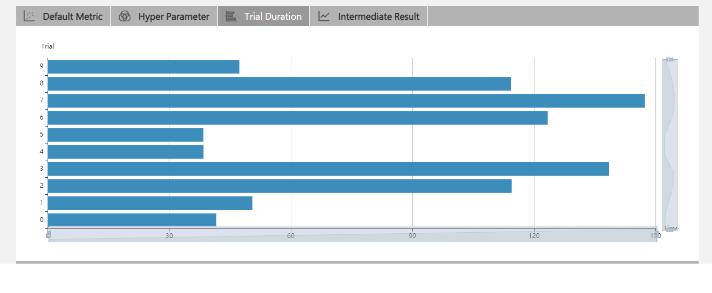

# QuickStart

## Installation

We support Linux and MacOS in current stage, Ubuntu 16.04 or higher, along with MacOS 10.14.1 are tested and supported. Simply run the following `pip install` in an environment that has `python >= 3.5`.

```bash
    python3 -m pip install --upgrade nni
```

Note:

* `--user` can be added if you want to install NNI in your home directory, which does not require any special privileges.
* If there is any error like `Segmentation fault`, please refer to [FAQ][1]
* For the `system requirements` of NNI, please refer to [Install NNI][2]

## Getting Start

In NNI, hyper-parameter searching space will be firstly defined using a json file (often called searchspace.json). According to the search space defined by this file, different hyper-parameter combinations will be generated to try and get feedback information like final accurary.

In order to use NNI, three things should be done as follows:

> Step 1 - Prepare a SearchSpace parameters file. 
 
First we should define a SearchSpace file so NNI could generate different sets of hyper-parameter, each of which is used to run an individual trial.

 - An example of a SearchSpace parameters file is shown below: 
    ```
    {
        "n_estimators":{"_type":"choice","_value":[100, 200, 300]},
        "max_depth":{"_type":"choice","_value":[2, 5, 8]}
    }
    ```
> Step 2 - Modify your model codes. 

In your model codes, in order to get a set of hyper-parameter received from NNI, we use `nni.get_next_parameter()`, which will return a dict like:
```
{
    "n_estimators": 0.5,
    "max_depth": 0.01
}
```
So, you can directly assign different values of the dict to their corressponding hyper-parameter in your model.

Next, since NNI needs to get the performance of this specific set of hyper-parameters, `nni.report_final_result(accuracy)` should be used after model evaluation.

A complete piece of code might be follow:
```diff
from sklearn.ensemble import RandomForestClassifier
+ import nni

+ RECEIVE_PARAMETER = nni.get_next_parameter()

- clf = RandomForestClassifier(n_estimators=100, max_depth=2, random_state=0)
+ clf = RandomForestClassifier(n_estimators=RECEIVE_PARAMETER['n_estimators'], max_depth=RECEIVE_PARAMETER['max_depth'], random_state=0)

train_x, train_y, test_x, test_y = get_data()

clf.fix(train_x, train_y)

acc = score(clf.predict(test_x), test_y)

+nni.report_final_result(acc)
```

> Step 3 - Prepare a configuration file for NNI.

This file will tell NNI things like where your code and your search space file are and so on. An simple example of this is shown below:

```
authorName: default
experimentName: example
trialConcurrency: 1
maxExecDuration: 1h
maxTrialNum: 10
trainingServicePlatform: local
# The path to Search Space
searchSpacePath: search_space.json
useAnnotation: false
tuner:
  builtinTunerName: TPE
trial:
  # The path and the running command of model training method(trial)
  command: python3 mnist.py
  codeDir: .
  gpuNum: 0
```


All the code above are stored in [examples/trials/mnist/][8]. When everything is ready, **run the config.yml file from your command line**.

```bash
    nnictl create --config nni/examples/trials/mnist/config.yml
```

Note: **nnictl** is a command line tool, which can be used to control experiments, such as start/stop/resume an experiment, start/stop NNIBoard, etc. Click [here][6] for more usage of `nnictl`

Wait for the message `INFO: Successfully started experiment!` in the command line. This message indicates that your experiment has been successfully started. And this is what we expected to get:

```
INFO: Starting restful server...
INFO: Successfully started Restful server!
INFO: Setting local config...
INFO: Successfully set local config!
INFO: Starting experiment...
INFO: Successfully started experiment!
-----------------------------------------------------------------------
The experiment id is egchD4qy
The Web UI urls are: http://223.255.255.1:8080   http://127.0.0.1:8080
-----------------------------------------------------------------------

You can use these commands to get more information about the experiment
-----------------------------------------------------------------------
         commands                       description
1. nnictl experiment show        show the information of experiments
2. nnictl trial ls               list all of trial jobs
3. nnictl top                    monitor the status of running experiments
4. nnictl log stderr             show stderr log content
5. nnictl log stdout             show stdout log content
6. nnictl stop                   stop an experiment
7. nnictl trial kill             kill a trial job by id
8. nnictl --help                 get help information about nnictl
-----------------------------------------------------------------------
```

If you prepare `trial`, `search space` and `config` according to the above steps and successfully create a NNI job, NNI will automatically tune the optimal hyper-parameters and run different hyper-parameters sets for each trial according to the requirements you set. You can clearly sees its progress by NNI WebUI.

## WebUI

After you start your experiment in NNI successfully, you can find a message in the command-line interface to tell you `Web UI url` like this:

```
The Web UI urls are: http://223.255.255.1:8080   http://127.0.0.1:8080
```

Open the `Web UI url`(In this information is: `http://223.255.255.1:8080`) in your browser, you can view detail information of the experiment and all the submitted trial jobs as shown below.

### View summary page

Click the tab "Overview".

* See the experiment trial profile and search space message.
* Support to download the experiment result.


* See good performance trials.


### View job default metric

Click the tab "Default Metric" to see the point graph of all trials. Hover to see its specific default metric and search space message.



### View hyper parameter

Click the tab "Hyper Parameter" to see the parallel graph.

* You can select the percentage to see top trials.
* Choose two axis to swap its positions



### View Trial Duration

Click the tab "Trial Duration" to see the bar graph.



### View trials status 

Click the tab "Trials Detail" to see the status of the all trials. Specifically:

* Trial detail: trial's id, trial's duration, start time, end time, status, accuracy and search space file.
* If you run a pai experiment, you can also see the hdfsLogPath.


* Kill: you can kill a job that status is running.
* Support to search for a specific trial.
* Intermediate Result Graph.


[1]: https://github.com/Microsoft/nni/blob/master/docs/FAQ.md
[2]: https://github.com/Microsoft/nni/blob/master/docs/Installation.md
[3]: https://github.com/Microsoft/nni/blob/master/examples/trials/mnist/search_space.json
[4]: https://github.com/Microsoft/nni/blob/master/examples/trials/mnist/mnist.py
[5]: https://github.com/Microsoft/nni/blob/master/examples/trials/mnist/config.yml
[6]: https://github.com/Microsoft/nni/blob/master/docs/NNICTLDOC.md
[7]: https://github.com/Microsoft/nni/blob/43981d732fefee9d938620f2c959bf8411bd3a29/examples/trials/mnist/mnist_without_nni.py
[8]: https://github.com/Microsoft/nni/tree/master/examples/trials/mnist